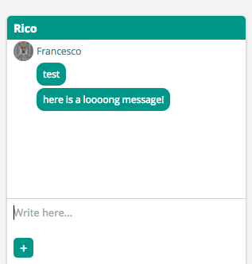

## Rico
A firebase-backed chat created in React.



## Installation

create an "app/_env.js" file with inside:

```javascript
var env={
  firebase:{//your firebase config}
}
module.exports=env;
```
Then run

```
  npm install
  npm run start
```

Then visit localhost:8080
